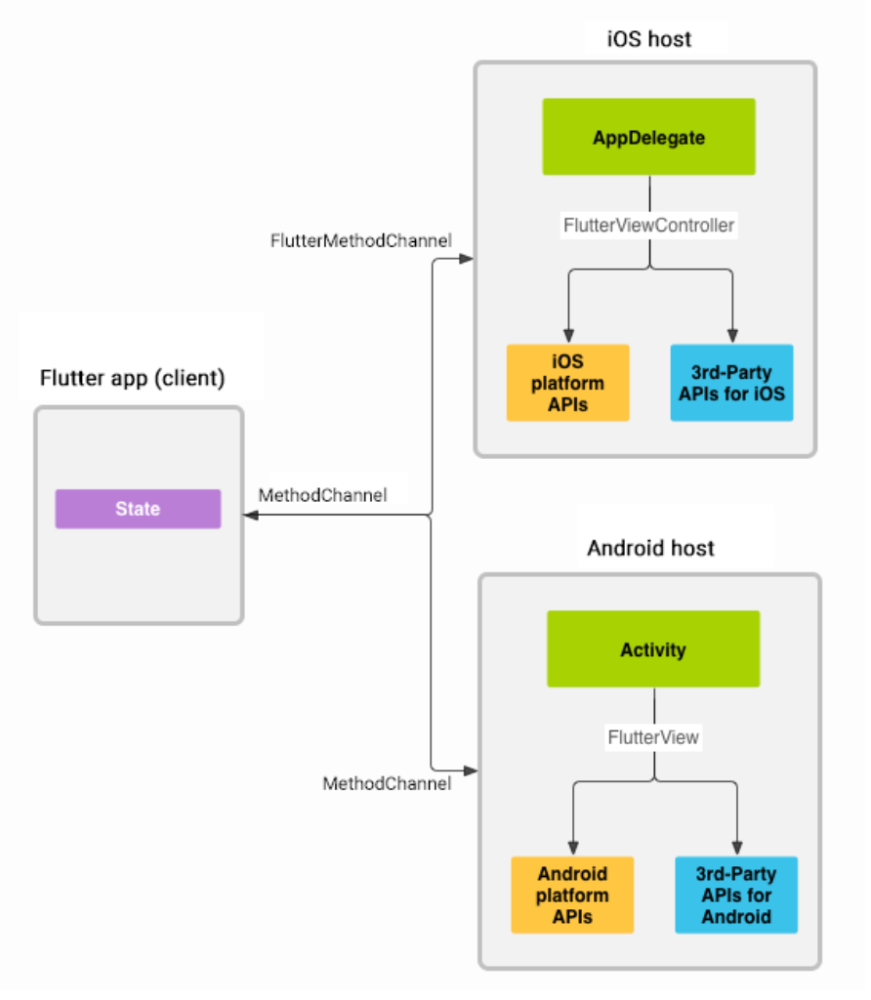

# Triển khai cho Android

Cách để triển khai 1 dự án Android có dạng Microservice.

#### Kiến trúc xây dựng dựa trên

- Android Studio: 2023.2.1
- Java: 11
- Gradle: 7.5
- Node >= 20
- React Native: 0.69.4
- Flutter: 3.19.3

#### Native Core:
- Tạo như cách tạo 1 dự án Android bình thường: Ở kiến trúc này hiện áp dụng cho XML, Jetpack Compose tương tự.
- Để tạo dự án:
  - `Android Studio` -> `New Project` -> `Empty Activity` -> `Next` -> Điền thông tin, ở dòng Build Configuration language chọn Groovy DSL -> `finish`
  - Sau khi hoàn thành các bước trên sẽ có cấu trúc tương tự: [Android](./yody_micro_android)

### Cấu hình
#### Flutter
1. <b>Lưu ý</b>
- Hiện tại Flutter đang gặp vấn đề với nhiều module khi cấu hình ở setting.gradle. Xem thêm lỗi tại [Github](https://github.com/flutter/flutter/issues/39707).
- Để khắc phục vấn đề này chúng ta sẽ tạo thêm 1 module với mục đích gom nhóm các module lại và module này sẽ tương tác với **Native Core**.
- Chúng ta cần tùy chỉnh router ở module gom nhóm để điều hướng tới các module mình mong muốn.
- Việc tạo Engine sẽ không ảnh hưởng.
- Chi tiết xem tại [Yody Umbrella](./yody_umbrella).
2. Tạo modules: Xem tại đây [Flutter](./flutter.md)
3. Tạo Engine cho các modules:
- <b>Ý tưởng</b>: Chúng ta sẽ tạo 1 class kế thừa FlutterActivity với mục đích sẽ xử lý các vấn đề liên quan tới giao tiếp, engine ngay tại class này.
```
//Tạo class kế FlutterActivity
class LoginActivity : FlutterActivity() {
    private var loginChannel : MethodChannel? = null
    companion object {

        //nếu muốn cache engine thì viết hàm này
        fun withCachedEngine(cachedEngineId: String): CachedEngineIntentBuilder {
            return CachedEngineIntentBuilder(LoginActivity::class.java, cachedEngineId)
        }
        
        //nếu dùng engine bình thường thì viết hàm này
        fun withNewEngine(): NewEngineIntentBuilder {
            return NewEngineIntentBuilder(LoginActivity::class.java)
        }
    }
}

//Sửa lại ở AndroidManifest.xml
//Thêm dòng sau nếu AndroidManifest của bạn chưa có
<activity
android:name=".LoginActivity"
android:exported="false" />

Lưu ý:
- Cần viết lại hàm tạo Engine để lúc tạo class có thể gọi tới
- Thay LoginActivity bằng tên Activity mà bạn mong muốn
```
4. Gắn các modules vào Native:
- Cấu hình ở setting.gradle
```
//Thêm dòng này vào pluginManagement, dependencyResolutionManagement
maven {
    url 'https://storage.googleapis.com/download.flutter.io'
}
```
```
//Sửa dependencyResolutionManagement từ RepositoriesMode.FAIL.... thành dòng dưới
repositoriesMode.set(RepositoriesMode.PREFER_SETTINGS)
```
```
//Chỉ trỏ vào thư mục gom nhóm
setBinding(new Binding([gradle: this]))                                // new
evaluate(new File(                                                     // new
        settingsDir.parentFile,                                            // new
        '#{Tên thư mục gom nhóm Flutter module}/.android/include_flutter.groovy'                   // new
))
```
- Cấu hình ở build.gradle (Module:app)
```
//Sửa phiên bản Java
compileOptions {
    sourceCompatibility 11
    targetCompatibility 11
}
//Thêm dòng sau ở dependencies
implementation project(':flutter')
```
#### React Native
1. Lệnh tạo ra file bundle:
- Trong file package.json thêm dòng để hỗ trợ tạo file bundle.
```
"scripts": {
    "start": "react-native start",
    "bundle:android": "react-native bundle --platform android --dev false --entry-file index.js --bundle-output ../yody_micro_android/app/src/main/assets/#{name}.index.android.bundle --assets-dest ../yody_micro_android/app/src/main/res"
}
Ex:
"scripts": {
    "start": "react-native start",
    "bundle:android": "react-native bundle --platform android --dev false --entry-file index.js --bundle-output ../yody_micro_android/app/src/main/assets/yody_employee.index.android.bundle --assets-dest ../yody_micro_android/app/src/main/res"
  }
Lưu ý:
- Thư mục assets chứa hình của các module con nên cần đặt tên theo từng module, để khi chạy lệnh tạo bundle thì trong thư mục assets lớn sẽ có nhưng assets theo tên module. Việc này tránh cho việc mất dữ liệu.
```
2. Gắn các modules vào Native:
- Cấu hình ở setting.gradle
```
//Thêm dòng này vào pluginManagement, dependencyResolutionManagement
maven {
    url ("$rootDir/../#{module_name}/node_modules/react-native/android")
}
//Nếu có nhiều hơn 1 module thì thêm tiếp vào
```
- Cấu hình ở build.gradle (Module:app)
```
//Thêm dòng sau ở dependencies
implementation "com.facebook.react:react-native:+" // From node_modules
implementation "org.webkit:android-jsc:+"
```
- Tùy chỉnh min/maxSDK nếu cần thiết
### Tương tác với modules
#### Flutter
1. Điều chỉnh route ở module gom nhóm để trỏ tới những module đúng
```
//file main của module gom nhóm
import 'package:flutter/material.dart';
import 'package:yody_login/main.dart';
import 'package:yody_profile/main.dart';

void main() => runApp(const MyApp());

class MyApp extends StatelessWidget {
  const MyApp({super.key});

  @override
  Widget build(BuildContext context) {
    return MaterialApp(
      title: 'Routes',
      initialRoute: '/',
      routes: {
        '/yody_login': (context) => const YodyLogin(),//redirect to login module
        '/yody_profile': (context) => const YodyProfile(),//redirect to profile module
      },
    );
  }
}
Lưu ý:
- /yody_login và /yody_profile: sẽ trỏ tới những module khi engine gọi tới.
```
2. Khởi chạy module
```
startActivity(
    LoginActivity
    .withNewEngine()
    .initialRoute("#{init_router}")
    .build(view.context)
)
Lưu ý:
- LoginActivity: Là class kế thừa FlutterActivity
- initRoute: Vì mình đã gom nhóm các module lại nên cần route để định hướng xem. initRoute chính là tên mà chúng ta khai báo ở bước 1. 
```
3. Truyền và nhận dữ liệu</br>
</br>
<b>Giải thích</b>
- Flutter và (Swift/Object) tương tác được với nhau thông qua 1 lớp gọi là **MethodChannel**
- Cơ chế gần tương tự như pub/sub tức là 1 bên bắn đi và 1 bên lắng nghe.</br></br>
<b>Áp dụng</b></br></br>
a. Đăng ký **MethodChannel** để truyền/nhận dữ liệu giữa Flutter và Native
- Khởi tạo MethodChannel ở Native Core:
```
//Ở class mà chúng ta đã extend từ FlutterActivity thêm như sau 
override fun configureFlutterEngine(flutterEngine: FlutterEngine) {
    super.configureFlutterEngine(flutterEngine)
    loginChannel = MethodChannel(flutterEngine.dartExecutor.binaryMessenger, "#{name}")
    loginChannel?.setMethodCallHandler { call, result ->
        if (call.method == "close") {
            this.finish()
        }
    }
}
=> Hàm này mục đích là để lấy engine đã tạo và tạo ra channel để nhận/bắn sự kiện cho Flutter
Lưu ý: 
- name: Dùng để định danh channel với mục đích có thể biết và kết nối được giữa Flutter và Kotlin
- call: Là biến bao gôm method, params để biết và xử lý
- result: Là 1 callback khi gọi thì sẽ trả kết quả ngược lại cho tầng Flutter Module để kết thúc công việc
```
- Khởi tạo MethodChannel ở FlutterModule:
```
const channel = MethodChannel('#{name}');
Lưu ý:
- name: Dùng để định danh channel với mục đích có thể biết và kết nối được giữa Flutter và Kotlin
```
- Gọi từ tầng Flutter Module xuống Native Core:
```
//Gọi từ tầng Flutter Module xuống tầng Native Core
chanel.invokeMapMethod('#{name}', #{params});
Ex: 

Lưu ý: 
- channel: Chính là biến tạo ở tầng Flutter Module ở bước trên 
- name: Định danh tên sự kiện bắn đi 
- params: Dữ liệu kèm theo sự kiện
```
- Gọi từ Native lên Flutter: Tương tự cơ chế ở bên trên.
```
//Viết ở Kotlin dùng để bắn sự kiên lên cho Flutter
this.loginChannel?.invokeMethod("result", arguments: {"input": 10})
//Flutter lắng nghe và làm việc
channel.setMethodCallHandler((call) async {
  final args = call.arguments as Map;
  setState(() {
    _counter = args['input'] as num;
  });
});
```
4. Làm sao để đóng 1 Flutter module? 
- Sẽ không thể đóng module bằng các hàm navigation bình thường vì lúc này UI được vẽ lên 1 ViewController của native.
- Để đóng được Flutter module thì chúng ta phải gọi từ Flutter Module xuống Native Core và Native Core sẽ chịu trách nhiệm đóng ViewController đó lại.
- Từ 2 ta có thể triển khai như sau:
```
//Flutter bắn 1 sự kiện để đóng Flutter Module
channel.invokeMapMethod('close');

//Native lắng nghe và đóng Flutter Module cần đóng
loginChannel?.setMethodCallHandler { call, result ->
    if (call.method == "close") {
        this.finish()
    }
}
```
5. Xem đầy đủ ví dụ tại: [Mẫu](./yody_micro_android)
#### React Native
1. Khởi chạy module</br>
**Hướng giải quyết**: **RCTRootView** chỉ là View nên để sử dụng được module thì cần tạo 1 Activity từ Native rồi gắn **RCTRootView** vào **Activity** đó. Và từ đó Activity này có nhiệm vụ tải và quản lý **RCTRootView**
```
//Activity để chạy RCTRootView
import PackageList
import android.app.Activity
import android.os.Bundle
import com.facebook.react.ReactInstanceManager
import com.facebook.react.ReactPackage
import com.facebook.react.ReactRootView
import com.facebook.react.common.LifecycleState
import com.facebook.react.modules.core.DefaultHardwareBackBtnHandler
import com.facebook.soloader.SoLoader
import com.omikitplugin.YodyFoodPackage


class FoodActivity : Activity(), DefaultHardwareBackBtnHandler {

    private var mReactRootView: ReactRootView? = null
    private var mReactInstanceManager: ReactInstanceManager? = null

    companion object {
        var fa: FoodActivity? = null
    }
    override fun onCreate(savedInstanceState: Bundle?) {
        super.onCreate(savedInstanceState)
        fa = this
        //tải RCTRootView
    }

    override fun invokeDefaultOnBackPressed() {
        super.onBackPressed()
    }
}
```

```
///Khởi tạo RCTRootView và gắn vào ViewController
SoLoader.init(this, false)
mReactRootView = ReactRootView(this)
val packages: MutableList<ReactPackage> = PackageList(application).packages.toMutableList()
packages.add(YodyFoodPackage())
// Packages that cannot be autolinked yet can be added manually here, for example:
// packages.add(new MyReactNativePackage());
// Remember to include them in `settings.gradle` and `app/build.gradle` too.
mReactInstanceManager = ReactInstanceManager.builder()
    .setApplication(application)
    .setCurrentActivity(this)
    .setBundleAssetName("#{bundle_name}")
    .addPackages(packages)
    .setInitialLifecycleState(LifecycleState.RESUMED)
    .build()
// The string here (e.g. "MyReactNativeApp") has to match
// the string in AppRegistry.registerComponent() in index.js
mReactRootView?.startReactApplication(mReactInstanceManager, "yody_food", null)
setContentView(mReactRootView)
Lưu ý:
- Khi tạo RCTRootView vào view của Activity thì React Native UI sẽ hiển thị
- YodyFoodPackage: là package chuyên phụ trách để nhận/bắn dữ liệu với React Naitve (tự viết bridge)
- bundle_name: là tên mà đã gen bằng lệnh `yarn bundle:android` lúc cấu hình
```
2. Truyền và nhận dữ liệu qua lại
- Khác với cơ chế bắn/nhận của Flutter thì React Native sẽ là bridge. Tức là chúng ta sẽ tạo bridge để 1 hàm gọi ở React Native sẽ tương ứng 1 hàm khai báo trong bridge ở Native. Khi muốn bắn từ Native lên React Native thì bridge cung cấp hàm kèm theo tên để có thể bắn dữ liệu lên.
- Để tạo bridge sẽ cần 3 file:
  - File JavaScript: Để viết các hàm để tầng JavaScript gọi và cũng là nơi để lấy ra NativeModule dùng cho việc lấy ra 1 bridge tạo ở Native.
  - Module file: Nơi viết các hàm chính tạo ra các hàm để xử lý và cho JavaScript gọi xuống
  - PackageFile: Là nơi gom nhiều module lại và cấu hình lúc tải cùng RCTRootView </br>
- Tạo module file:
```
class YodyFoodModule(reactContext: ReactApplicationContext?) :
    ReactContextBaseJavaModule(reactContext) {
    override fun getName(): String {
        return "YodyFoodBridge"
    }
    @ReactMethod
    fun close(promise: Promise) {
        FoodActivity.fa?.finish()
    }
}
Lưu ý: 
- getName: Là tên Bridge, từ đây nên tạo trên JavaScript lấy được từ `NativeModules`
```

- Tạo package file:
```
class YodyFoodPackage : ReactPackage {
    override fun createNativeModules(reactContext: ReactApplicationContext): List<NativeModule> {
        return listOf(
            YodyFoodModule(reactContext),
        )
    }

    override fun createViewManagers(p0: ReactApplicationContext): MutableList<ViewManager<View, ReactShadowNode<*>>> {
        return arrayListOf()
    }
}
Lưu ý: 
- createNativeModules: Đăng ký module cho package
- createViewManagers: Nếu cần sử dụng View ở native thì dùng hàm này, còn không thì bỏ qua.
```
- Tạo file ở React Native
```
import { NativeModules, NativeEventEmitter } from 'react-native';
const { YodyFoodBridge } = NativeModules;
//lấy ra được bridge từ NativeModules
export default YodyFoodBridge;
//Dùng để nhận sự kiện từ Native bắn lên (Nếu không có thì không cần)
export const YodyFoodEmitter = new NativeEventEmitter(YodyFoodBridge);
//Đăng ký tên sự kiện (trùng với supportedEvents ở Native)
export const YodyFoodCallEvent = {
};
```
**Xong rồi bây giờ tiến hành viết hàm để sử dụng thôi nào**</br>
