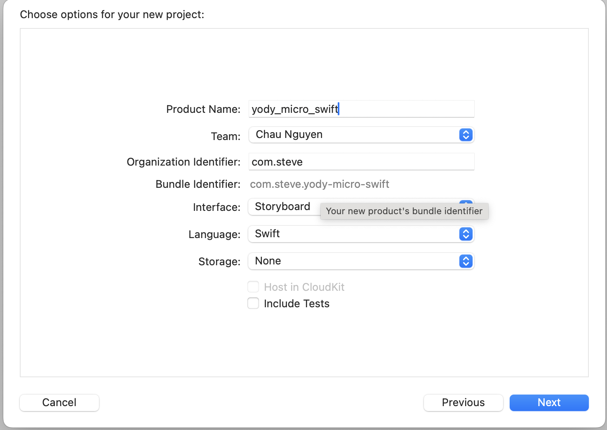
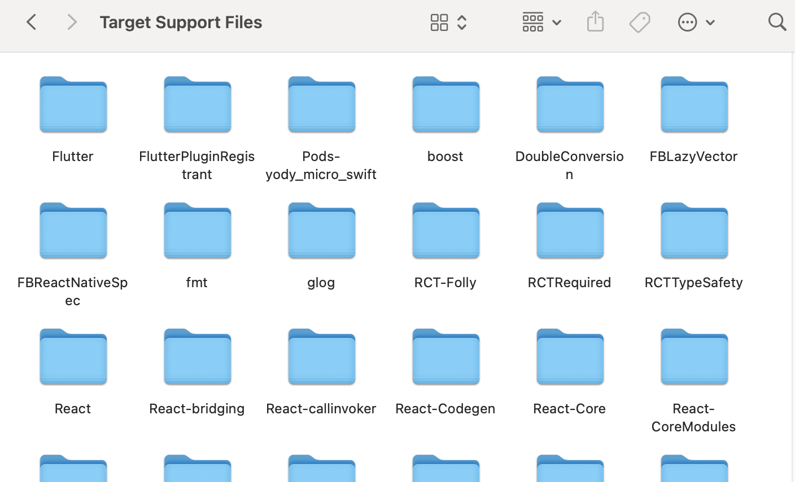

# Triển khai cho iOS

Cách để triển khai 1 dự án iOS có dạng Microservice.

#### Kiến trúc xây dựng dựa trên

- Xcode >= 15
- Swift > 5
- Node >= 20
- React Native: 0.69.4
- Flutter: 3.19.3


#### Native Core:
- Tạo như cách tạo 1 dự án iOS bình thường: Ở kiến trúc này hiện áp dụng cho bộ UIKit, SwiftUI sẽ hỗ trợ trong thời gian tới. Và hiện tại vẫn dùng AppDelegate, SceneDelegate cấu hình tương tự nếu muốn dùng.
- Để tạo dự án:
  - `Xcode` -> `Create New Project` -> `iOS` ở trên thanh công cụ hiện lên ở Dialog -> Điền theo thông tin như bên dưới:</br></br>

  - Tạo Pod file: `cd #{folder name} && pod init && pod install`
  - Sau khi hoàn thành các bước trên sẽ có cấu trúc tương tự: [Swift](./yody_micro_swift)
 
> **Warning**
> Nếu dùng SceneDelegate thì **bỏ thông làm theo các bước tiếp theo**
- Loại bỏ SceneDelegate:
  - Xóa file SceneDelegate
  - Xóa `UIApplicationSceneManifest` trong `info.plist`

#### Flutter

1. Tạo modules: Xem tại đây [Flutter](./flutter.md)
2. Tạo Engine cho các modules:
- Tạo các Engine ứng với các module ở `AppDelegate`
```
import UIKit
import Flutter
import FlutterPluginRegistrant

@main
class AppDelegate: UIResponder, UIApplicationDelegate {

    var window: UIWindow?
    -------
    var loginEngine: FlutterEngine?
    var profileEngine: FlutterEngine?
    -------
    
    func application(_ application: UIApplication, didFinishLaunchingWithOptions launchOptions: [UIApplication.LaunchOptionsKey: Any]?) -> Bool {
        // Tạo và đăng ký Engine
        -------------
        loginEngine = FlutterEngine.init(name: "login_engine")
        profileEngine = FlutterEngine.init(name: "profile_engine")
        GeneratedPluginRegistrant.register(with: loginEngine!)
        GeneratedPluginRegistrant.register(with: profileEngine!)
        -------------
        return true
    }
}
Lưu ý: Tên của Engine dùng để định danh -> có thể đặt bất kì nhưng tốt nhất nên theo tên module để dễ phân biệt
```
3. Gắn các modules vào Native:
- Vào podfile thêm dòng dưới dòng cấu hình phiên bản cho Platform
```
#platform :ios, '13.0'
# Ở ngoài hàm Target
flutter_login_application_path = '#{module_path}'
load File.join(flutter_login_application_path, '.ios', 'Flutter', 'podhelper.rb')
Ex:
flutter_login_application_path = '../yody_login'
load File.join(flutter_login_application_path, '.ios', 'Flutter', 'podhelper.rb')
flutter_profile_application_path = '../yody_profile'
load File.join(flutter_profile_application_path, '.ios', 'Flutter', 'podhelper.rb')
```
- Thêm hàm chạy thư viện ở trong hàm Target
```
install_all_flutter_pods([#{Danh sách đường dẫn tạo ở bước trên}])
Ex:
install_all_flutter_pods([flutter_login_application_path, flutter_profile_application_path])
```
- Sửa lại ở pod install 
```
post_install do |installer|
    flutter_post_install(installer) if defined?(flutter_post_install)
end
```
- Khi hoàn thành sẽ có cấu trúc tương tự: [PodFile](./yody_micro_swift/Podfile)
- `pod install` để kéo thư viện về
- Khi xong sẽ thấy các thư viện mà Flutter cần ở folder `Pods/Target Support` Files </br>

> **Warning**
> Trên Xcode 15 hiện đang có 1 lỗi là không cấu hình để tự động tạo file `Info.plist` cho các module. Để giải quyết vấn đề này mỗi lần `pod install` thì làm như sau:
- `Xcode` -> `Pods` -> `Build Settings` (Chọn tab all) -> Tìm `Generate Info.plist file` và chuyển thành `Yes`
