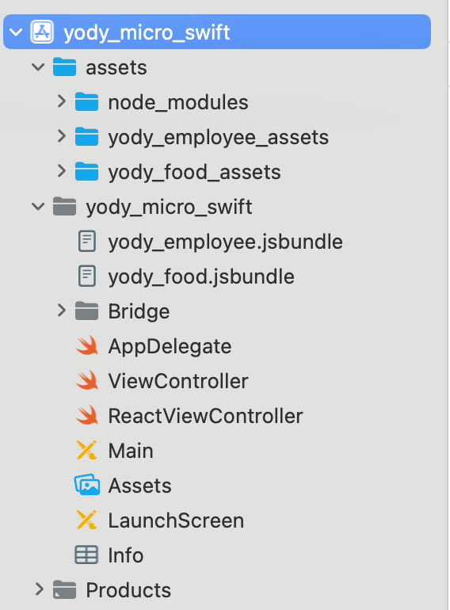
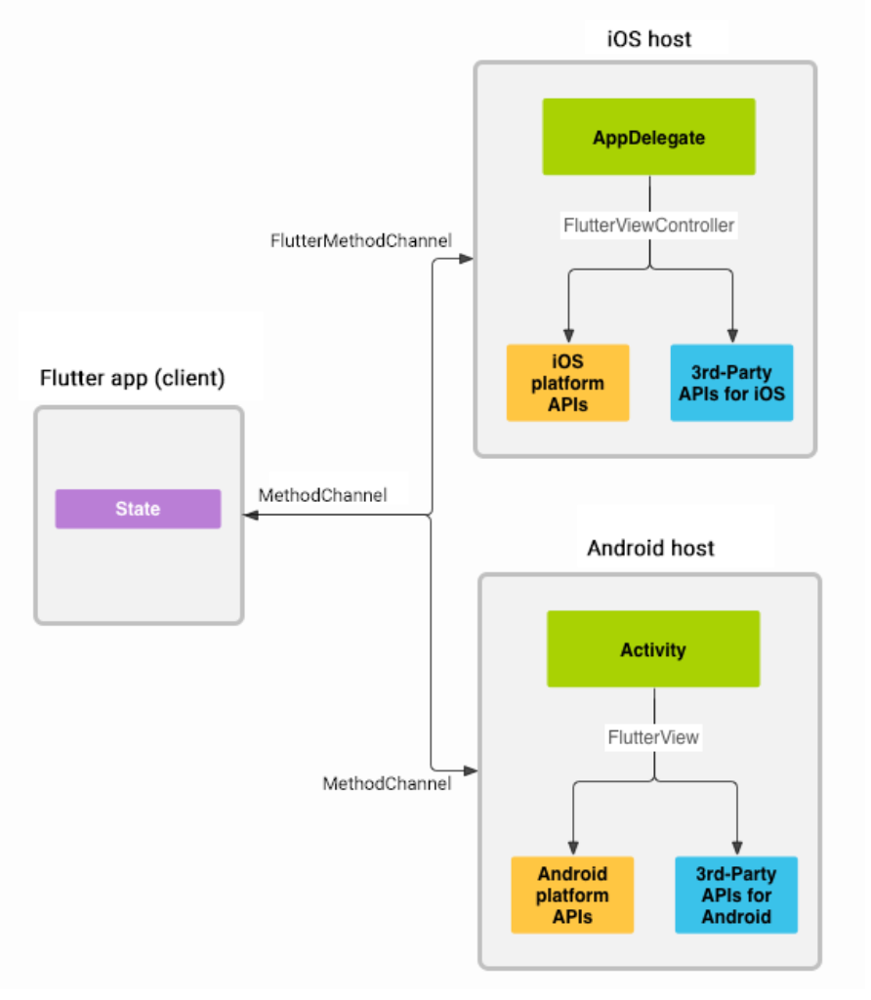

# Triển khai cho iOS

Cách để triển khai 1 dự án iOS có dạng Microservice.

#### Kiến trúc xây dựng dựa trên

- Xcode >= 15
- Swift > 5
- Node >= 20
- React Native: 0.69.4
- Flutter: 3.19.3


#### Native Core:
- Tạo như cách tạo 1 dự án iOS bình thường: Ở kiến trúc này hiện áp dụng cho bộ UIKit, SwiftUI sẽ hỗ trợ trong thời gian tới. Và hiện tại vẫn dùng AppDelegate, SceneDelegate cấu hình tương tự nếu muốn dùng.
- Để tạo dự án:
  - `Xcode` -> `Create New Project` -> `iOS` ở trên thanh công cụ hiện lên ở Dialog -> Điền theo thông tin như bên dưới:</br></br>

  - Tạo Pod file: `cd #{folder name} && pod init && pod install`
  - Sau khi hoàn thành các bước trên sẽ có cấu trúc tương tự: [Swift](./yody_micro_swift)
 
> **Warning**
> Nếu dùng SceneDelegate thì **bỏ thông làm theo các bước tiếp theo**
- Loại bỏ SceneDelegate:
  - Xóa file SceneDelegate
  - Xóa `UIApplicationSceneManifest` trong `info.plist`

### Cấu hình
#### Flutter

1. Tạo modules: Xem tại đây [Flutter](./flutter.md)
2. Tạo Engine cho các modules:
- Tạo các Engine ứng với các module ở `AppDelegate`
```
import UIKit
import Flutter
import FlutterPluginRegistrant

@main
class AppDelegate: UIResponder, UIApplicationDelegate {

    var window: UIWindow?
    -------
    var loginEngine: FlutterEngine?
    var profileEngine: FlutterEngine?
    -------
    
    func application(_ application: UIApplication, didFinishLaunchingWithOptions launchOptions: [UIApplication.LaunchOptionsKey: Any]?) -> Bool {
        // Tạo và đăng ký Engine
        -------------
        loginEngine = FlutterEngine.init(name: "login_engine")
        profileEngine = FlutterEngine.init(name: "profile_engine")
        GeneratedPluginRegistrant.register(with: loginEngine!)
        GeneratedPluginRegistrant.register(with: profileEngine!)
        -------------
        return true
    }
}
Lưu ý: Tên của Engine dùng để định danh -> có thể đặt bất kì nhưng tốt nhất nên theo tên module để dễ phân biệt
```
3. Gắn các modules vào Native:
- Vào podfile thêm dòng dưới dòng cấu hình phiên bản cho Platform
```
#platform :ios, '13.0'
# Ở ngoài hàm Target
flutter_login_application_path = '#{module_path}'
load File.join(flutter_login_application_path, '.ios', 'Flutter', 'podhelper.rb')
Ex:
flutter_login_application_path = '../yody_login'
load File.join(flutter_login_application_path, '.ios', 'Flutter', 'podhelper.rb')
flutter_profile_application_path = '../yody_profile'
load File.join(flutter_profile_application_path, '.ios', 'Flutter', 'podhelper.rb')
```
- Thêm hàm chạy thư viện ở trong hàm Target
```
install_all_flutter_pods([#{Danh sách đường dẫn tạo ở bước trên}])
Ex:
install_all_flutter_pods([flutter_login_application_path, flutter_profile_application_path])
```
- Sửa lại ở pod install 
```
post_install do |installer|
    flutter_post_install(installer) if defined?(flutter_post_install)
end
```
- Khi hoàn thành sẽ có cấu trúc tương tự: [PodFile](./yody_micro_swift/Podfile)
- `pod install` để kéo thư viện về
- Khi xong sẽ thấy các thư viện mà Flutter cần ở thư mục `Pods/Target Support` Files </br></br>

> **Warning**
> Trên Xcode 15 hiện đang có 1 lỗi là không cấu hình để tự động tạo file `Info.plist` cho các module. Để giải quyết vấn đề này mỗi lần `pod install` thì làm như sau:
- `Xcode` -> `Pods` -> `Build Settings` (Chọn tab all) -> Tìm `Generate Info.plist file` và chuyển thành `Yes`

#### React Native
1. Lệnh tạo ra file bundle:
- Trong file package.json thêm dòng để hỗ trợ tạo file bundle.
```
"scripts": {
    "start": "react-native start",
    "bundle:ios": "react-native bundle --entry-file index.js --platform ios --dev false --bundle-output ../#{native folder}/#{native folder}/#{module_name}.jsbundle --assets-dest ../#{native folder}"
}
Ex:
"scripts": {
    "start": "react-native start",
    "bundle:ios": "react-native bundle --entry-file index.js --platform ios --dev false --bundle-output ../yody_micro_swift/yody_micro_swift/yody_employee.jsbundle --assets-dest ../yody_micro_swift"
  }
Lưu ý:
- Thư mục assets chứa hình của các module con nên cần đặt tên theo từng module, để khi chạy lệnh tạo bundle thì trong thư mục assets lớn sẽ có nhưng assets theo tên module. Việc này tránh cho việc mất dữ liệu.
```
- Tiến hành thêm thư mục vào Xcode:
`Xcode` -> `Build Phases` -> `Copy Bundle Resources` -> `+` -> Chọn thư mục assets lớn vừa mới tạo từ bước 1
- Khi thực hiện xong sẽ tương tự như sau: </br></br>


2. Gắn các modules vào Native:
- Vào podfile thêm dòng dưới dòng cấu hình phiên bản cho Platform
```
#platform :ios, '13.0'
# Ở ngoài hàm Target
require_relative '../#{module_name}/node_modules/react-native/scripts/react_native_pods'
require_relative '../#{module_name}/node_modules/react-native/scripts/react_native_pods'
Ex:
require_relative '../yody_food/node_modules/react-native/scripts/react_native_pods'
require_relative '../yody_food/node_modules/@react-native-community/cli-platform-ios/native_modules'
require_relative '../yody_employee/node_modules/react-native/scripts/react_native_pods'
require_relative '../yody_employee/node_modules/@react-native-community/cli-platform-ios/native_modules'
```
- Thêm ở trong `Target` Podfile
```
target '#{module_name}' do
  # Comment the next line if you don't want to use dynamic frameworks
  use_frameworks!
    # Flags change depending on the env values.
  flags = get_default_flags()
  use_react_native!(:path => '../#{module_name}/node_modules/react-native')

  # Pods for yody_micro_swift
  post_install do |installer|
    installer.pods_project.targets.each do |target|
      target.build_configurations.each do |config|
        config.build_settings['IPHONEOS_DEPLOYMENT_TARGET'] = '13.0'
      end
    end
    __apply_Xcode_12_5_M1_post_install_workaround(installer)
  end
end
Lưu ý: Nếu có nhiều hơn 1 module thì chỉ cần trỏ để lấy 1 phiên bản react-native ở Target (Chỉ dùng được 1 phiên bản)
```
- Khi hoàn thành sẽ có cấu trúc tương tự: [PodFile](./yody_micro_swift/Podfile)
- `pod install` để kéo thư viện về
- Khi xong sẽ thấy các thư viện mà Flutter cần ở thư mục `Pods/Target Support` Files </br></br>


### Tương tác với modules
#### Flutter
1. Khởi chạy module
- Vì có nhiều module nên chúng ta cần biết cần chạy module nào. Flutter có hỗ trợ để biết việc đó.
```
DispatchQueue.main.async { [weak self] in
  guard let self = self else { return }
  let engine = delegate.loginEngine
  engine?.run(withEntrypoint: "#{funnction_name}", libraryURI: "#{path}")
  let window = delegate.window
  let flutterController = FlutterViewController(engine: engine!, nibName: nil, bundle: nil)
  flutterController.modalPresentationStyle = .fullScreen
  window?.rootViewController?.present(flutterController, animated: true)
}
Ex: 
DispatchQueue.main.async { [weak self] in
  guard let self = self else { return }
  let engine = delegate.profileEngine
  engine?.run(withEntrypoint: "main", libraryURI: "package:yody_profile/main.dart")
  let window = delegate.window
  let flutterController = FlutterViewController(engine: engine!, nibName: nil, bundle: nil)
  self.profileChannel = FlutterMethodChannel.init(name: "profile", binaryMessenger: flutterController.binaryMessenger)
  flutterController.modalPresentationStyle = .fullScreen
  window?.rootViewController?.present(flutterController, animated: true)
}
Lưu ý: 
- Cần gọi hàm run ở main thread
- withEntrypoint: có thể null, nếu null thì mặc định sẽ lấy hàm main và set giá trị thì sẽ lấy hàm truyền vào
- libraryURI: là file chưa hàm truyền vào trong withEntrypoint
- initialRoute: là route đầu tiên, nếu dùng 2.0 có thể dùng (không bắt buộc)
```
2. Truyền và nhận dữ liệu qua lại</br>
</br>
<b>Giải thích</b>
- Flutter và (Swift/Object) tương tác được với nhau thông qua 1 lớp gọi là **MethodChannel**
- Cơ chế gần tương tự như pub/sub tức là 1 bên bắn đi và 1 bên lắng nghe nhận lại.</br></br>
<b>Áp dụng</b></br>
a. Đăng ký **MethodChannel** để truyền/nhận dữ liệu giữa Flutter và Native
- Khởi tạo MethodChannel ở Native Core:
```
//Tạo biến
var loginChannel : FlutterMethodChannel?
//Tạo Channel
self.loginChannel = FlutterMethodChannel.init(name: "#{name}", binaryMessenger: flutterController.binaryMessenger)
// thường đặt dưới dòng tạo FlutterViewController

Ex: 
var loginChannel : FlutterMethodChannel?
self.loginChannel = FlutterMethodChannel.init(name: "login", binaryMessenger: flutterController.binaryMessenger)
Lưu ý:
- name: Dùng để định danh channel với mục đích có thể biết và kết nối được giữa Flutter và Swift
```
- Khởi tạo MethodChannel ở FlutterModule:
```
const channel = MethodChannel('#{name}');
Lưu ý:
- name: Dùng để định danh channel với mục đích có thể biết và kết nối được giữa Flutter và Swift
```
- Cách gọi từ tầng Flutter Module xuống Native Core:
```
//cách gọi từ tầng Flutter Module xuống tầng Native Core
chanel.invokeMapMethod('#{name}', #{params});

Ex: 

Lưu ý: 
- channel: Chính là biến tạo ở tầng Flutter Module ở bước trên 
- name: Định danh tên sự kiện bắn đi 
- params: Dữ liệu kèm theo sự kiện
```
```
//Cách Native Core tiếp nhận sự kiện, xử lý và trả ngược lại cho Flutter Module
self.loginChannel?.setMethodCallHandler({ [weak self] call, result in
    guard let self = self else { return }
})

Ex: 
self.loginChannel?.setMethodCallHandler({ [weak self] call, result in
            guard let self = self else { return }
    if (call.method == "result") {
        if let arguments = call.arguments as? [String: Any], let flutterResultText = arguments["result"] as? Int {
            self.flutterResult.text = "\(flutterResultText)"
            flutterController.dismiss(animated: true)
        }
    }
    if (call.method == "close") {
      flutterController.dismiss(animated: true)
    }
})
Lưu ý:
- loginChannel: Là biến khởi tạo ở bước 1
- call: Là biến bao gôm method, params để biết và xử lý
- result: Là 1 callback khi gọi thì sẽ trả kết quả ngược lại cho tầng Flutter Module để kết thúc công việc
```
3. Làm sao để đóng 1 Flutter module? 
- Sẽ không thể đóng module bằng các hàm navigation bình thường vì lúc này UI được vẽ lên 1 ViewController của native.
- Để đóng được Flutter module thì chúng ta phải gọi từ Flutter Module xuống Native Core và Native Core sẽ chịu trách nhiệm đóng ViewController đó lại.
- Từ 2 ta có thể triển khai như sau:
```
//Flutter bắn 1 sự kiện để đóng Flutter Module
channel.invokeMapMethod('close');

//Native lắng nghe và đóng Flutter Module cần đóng
self.loginChannel?.setMethodCallHandler({ [weak self] call, result in
            guard let self = self else { return }
    if (call.method == "close") {
      flutterController.dismiss(animated: true)
    }
})
```